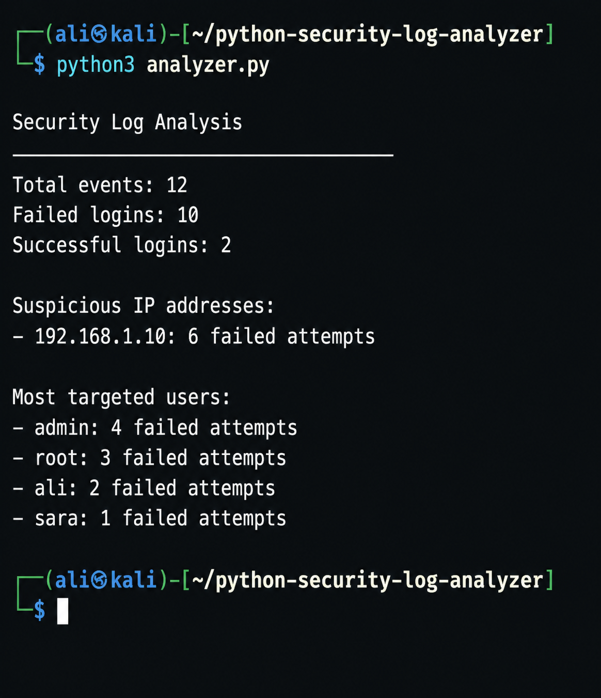

# Python Security Log Analyzer

A Python security tool that analyzes authentication logs, counts failed login attempts, identifies suspicious IP addresses, and displays the most targeted user accounts.

## Features

- Reads authentication events from a log file
- Counts successful and failed login attempts
- Detects IP addresses with repeated login failures
- Identifies the most targeted user accounts
- Sorts results by the number of failed attempts
- Handles missing files and malformed log entries safely

## Detection Logic

An IP address is marked as suspicious when it reaches:

```text
5 or more failed login attempts
```

The threshold can be changed inside `analyzer.py`:

```python
SUSPICIOUS_THRESHOLD = 5
```

## Project Structure

```text
python-security-log-analyzer/
├── analyzer.py
├── README.md
├── assets/
│   └── security-log-analysis.png
└── sample_logs/
    └── authentication.log
```

## Requirements

- Python 3.9 or newer
- No external Python packages are required

## How to Run

Clone the repository:

```bash
git clone https://github.com/aliabozaid777/python-security-log-analyzer.git
```

Enter the project folder:

```bash
cd python-security-log-analyzer
```

Run the analyzer:

```bash
python3 analyzer.py
```

## Sample Output

The analyzer detected repeated failed login attempts from one IP address and ranked the most targeted accounts.



## Example Findings

```text
Total events: 12
Failed logins: 10
Successful logins: 2

Suspicious IP addresses:
- 192.168.1.10: 6 failed attempts

Most targeted users:
- admin: 4 failed attempts
- root: 3 failed attempts
- ali: 2 failed attempts
- sara: 1 failed attempt
```

## Skills Demonstrated

- Python programming
- Log parsing
- Security event analysis
- Brute-force activity detection
- Error handling
- Data counting and sorting
- Defensive cybersecurity fundamentals

## Limitations

- The current version analyzes a simple custom log format
- It does not process live system logs
- Detection is based only on the number of failed attempts
- IP reputation and time-based correlation are not included yet

## Future Improvements

- Export findings to a CSV report
- Accept custom files and thresholds from the command line
- Track the first and last activity time for each IP
- Add automated tests
- Support common Linux authentication log formats

## Ethical Note

This project uses fictional authentication data for learning and defensive security purposes only.
